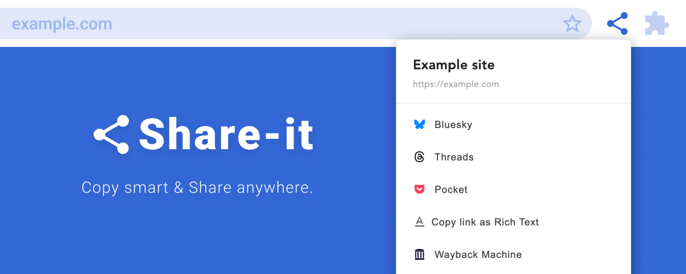

# share-it



A browser extension that allows you to share and copy web pages in various ways.


## Get the Extension
* [Chrome Web Store](https://chrome.google.com/webstore/detail/share-it/kmfmfcdigkgfhmnopjfdnaikhjkmmplm)
* [Add-ons for Firefox](https://addons.mozilla.org/ja/developers/addon/share-it/)
* [Edge Add-ons](TODO)


## Development
need a Node.js environment.
```zsh
npm i
npm start
```


## For Firefox review team
To review the source code and build it, please run the following command:
```zsh
npm run build:firefox
```
